## Jenkins


### What is Jenkins?

Jenkins is an **open-source automation server** in which the central build and CI process take place. It is a Java-based program with packages for Windows, macOS & Linux.

<br>

### Stages of Jenkins:
**1** — Creating a Jenkins job 

**2** — Building a pipeline in Jenkins

**3** — Linking the jobs

<br>

### What alternatives are there for Jenkins?
* CircleCi
* TeamCity
* Bamboo
* GitLab

<br>

### Why Jenkins?

* Jenkins has great range of plugins available.
* it supports building, deploying and automating for software development projects.
* easy installation.
* simple and user-friendly interface.
* extensible with huge community-contributed plugin resource.
* easy environment configuration in user interface.
* supports distributed builds with master-slave architecture.


<br>

### Jenkins Job page:

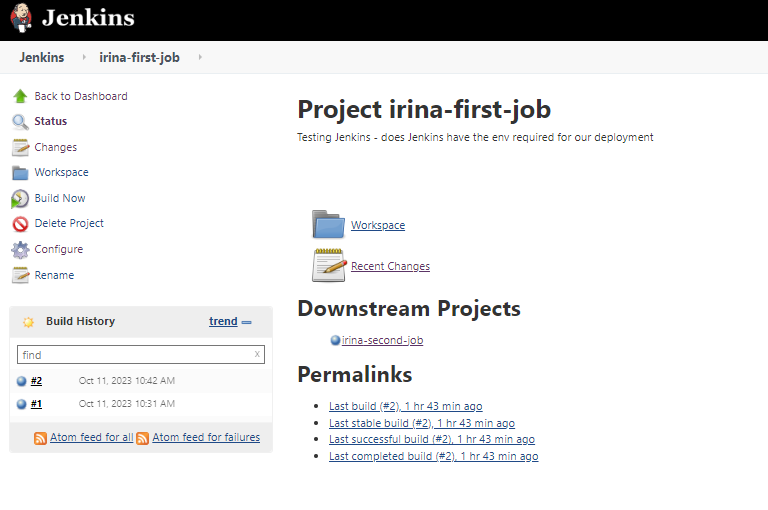

You can see everything to do with your Job.

<br>


## Steps for creating a Job and setting up WebHook (1st Job - 'CI'):

1. Initialise a new Job: 

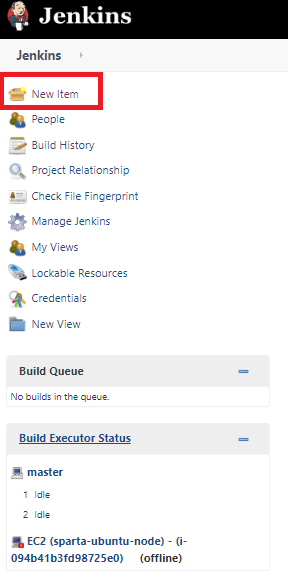

2. Choose a name and then click Freestyle project:

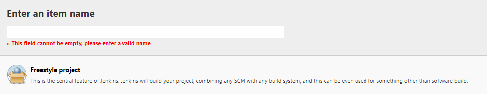

3. Write a Description:

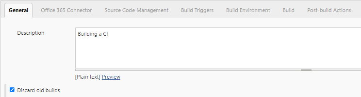

4. Select Discard old builds and enter the IP Address for the repo:


5. In Webhook, add your Repository link:

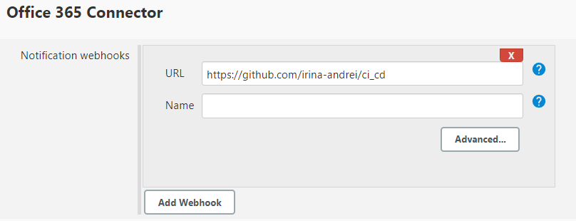

6. Restrict where the project can be run:


7. Enter the SSH url for the repo and the key to access, as well as the branch (we will work on 'dev' until the build passes the tests):

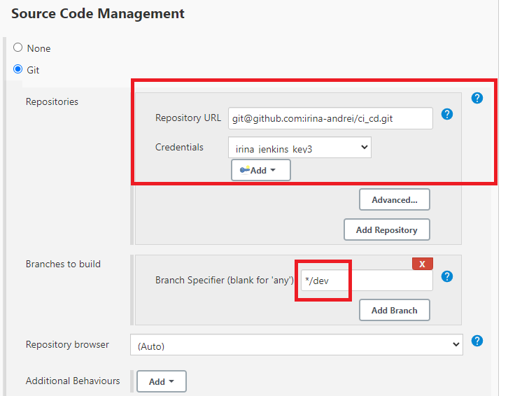

8. In Build Trigger, tick the 'GitHub hook trigger for GITScm polling' box:

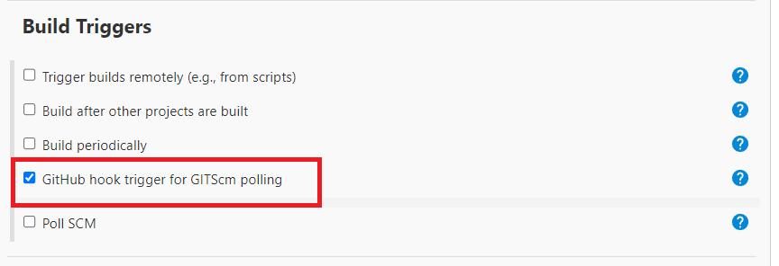

9. Tick "Provide Node & npm bin/folder to PATH" box:

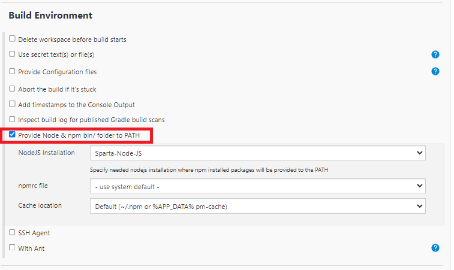

10. Add 'Execute shell' Commands:

```shell
cd app
npm install
npm test
```

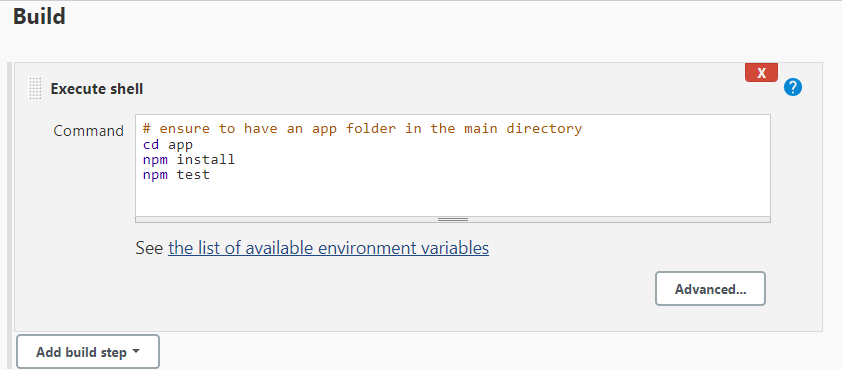

11. Add Post Build setting, to trigger the next job (will show error if that job hasn't been created yet):

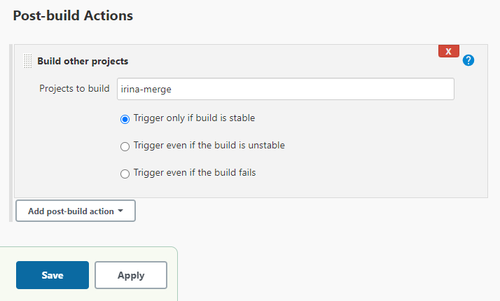

11. After you saved it, press Build Now to run:

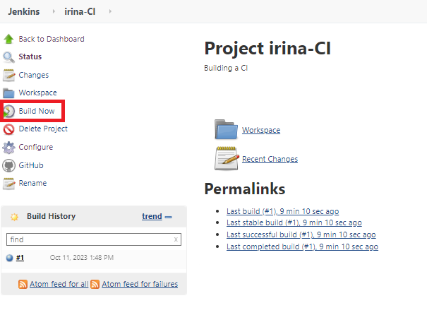

12. On GitHub, add Webhook in the settings of your repository:

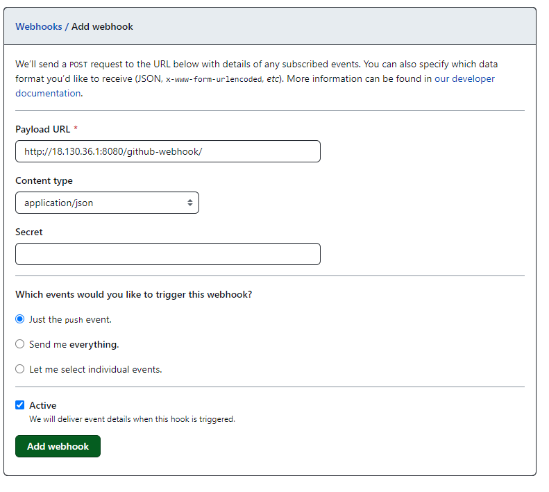

13. In Build History, you'll be able to see the Console Output:

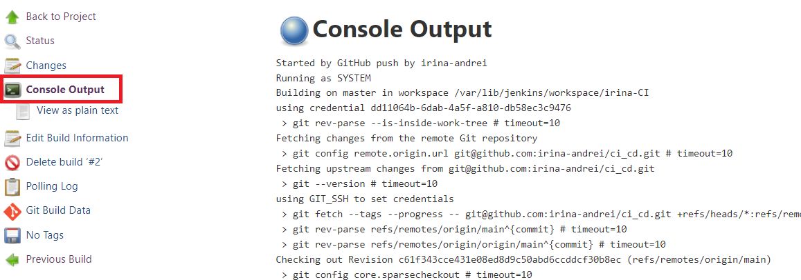

<br>

Sources:

[GitHub - Jenkins - blazemeter.com](https://www.blazemeter.com/blog/how-to-integrate-your-github-repository-to-your-jenkins-project)

[DevOps Culture and CI/CD](https://medium.com/@ahshahkhan/devops-culture-and-cicd-3761cfc62450)