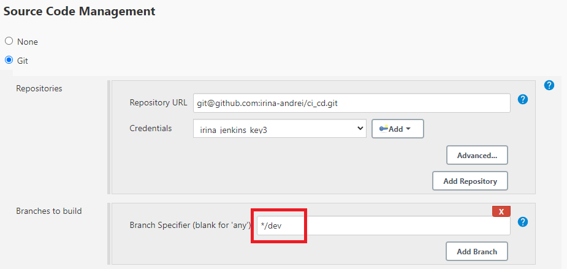
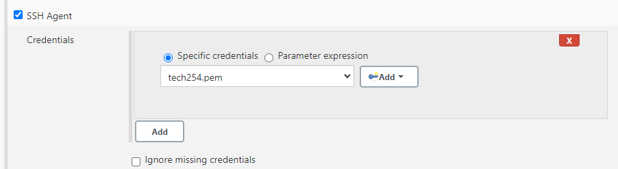
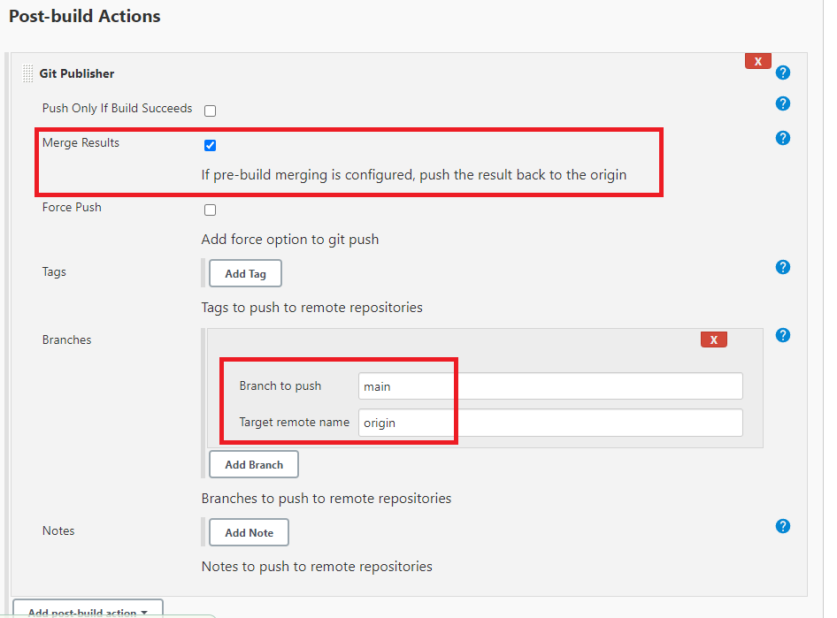

# Jenkins CI Task

Our current CI setup on Jenkins has one major flaw. The build is currently started and the tests are run on the main branch of the repository. This means that if the tests fail the code still exists on the main branch (which is only supposed to contain working code).

We need to reconfigure the job so that the code is tested on a different branch (dev) and automatically merged with the main branch if the tests pass.

 

### Steps (2nd Job - 'CI-merge'):

1. 

2. 

3. Restrict where the project can be run:

4. Configure your job to checkout code from the dev branch rather than the main branch.

5. Choose the 'main' branch to merge to:

6. Add SSH credentials:

3. In the Git Publisher plugin, ticking the box and adding these settings will result in pushing the main branch to Github if the tests pass:

4. After a push to the 'dev' branch of the repo, the 2 jobs ('CI' & 'CI-merge') will run and both 'main' and 'dev' branches will be updated on GitHub: 

 

Sources: 

[Jenkins Git Merges](https://andrewtarry.com/posts/jenkins_git_merges/)

