# Jenkins CD Task


<br>

## Best practices for CI/CD pipeline

CI/CD pipeline = a set of automated steps that help developers integrate, test and deploy code smoothly and frequently. 

* **Commit early and often**: This ensures that the code is always up to date, reduces merge conflicts and triggers the CI/CD process.

* **Build only once**: The same build artifacts should be used throughout the pipeline. This avoids inconsistencies and ensures that what is tested is what is deployed.

* **Streamline your tests**: To optimize your testing process, you should run your fastest and most critical tests first.

* **Clean your environments**: Remove any unused or outdated data and use tools to create isolated and reproducible environments.

* **Make it the only way to deploy to production**: This ensures that every change is tested, verified and traceable and avoids manual errors or unauthorized deployments.

* **Monitor and measure your pipeline**: You should use tools to collect and visualize metrics and use feedback loops to identify any issues.

* **Make it a team effort**: Use tools to coordinate work and adopt a culture of transparency, trust and continuous improvement.

* **Keep your pipelines fast**: Reduce unnecessary steps, cache dependencies, use incremental builds and scale your resources.

<br>

## How to Approach a Task:

* Define the scope and purpose
* Set the requirements and dependencies
* Create a diagram
* Break down in increments

<br>

## SDLC - Software Development Life Cycle

The Software Development Life Cycle = a process that helps developers create high-quality software in a systematic and efficient way. It ensures that the software meets the requirements, expectations and goals of the stakeholders.

The 6 Main Phases:

1. **Requirement analysis**: analyze the needs and specifications.

2. **Planning**: how to implement the requirements.

3. **Software design**: design the structure of the software.

4. **Software development**: write the code for the software with version control.

5. **Testing**: test the software for functionality, performance, reliability and security. 

6. **Deployment**: deploy the software to the production environment.

The SDLC is not a one-time process, but rather a continuous cycle that repeats itself as long as the software is in use.

<br>

## **Our Production Environment Requirements**:

### * DataBase Instance

* Server / VM / EC2: **Linux - ubuntu 18.04 LTS**
* **MongoDB** installed with v3.2
* Allow app to connect: bind IP should allow app - **0.0.0.0**


### * App Instance

* Server / VM / EC2: **Linux - ubuntu 18.04 LTS**
* **Node.js 6** or above
* app folder inside the environment
* DB_host=db-ip:27017

<br>


### Steps we will take:


1. On Jenkins, creating the CI and Merge jobs ('irina-CI' and 'irina-merge') and making sure they are running smoothly.

2. Creating a new job on Jenkins called 'irina-cd'.

3. Triggering the new job ('irina-cd') from the Merge job ('irina-merge'). This will only run if the first 2 builds have run successfully.

4. Allowing Jenkins to SSH into the EC2 instance (adding the -y command will make sure there's no need to manually allow the SSH into the instance).

5. Adding shell code that will execute when the job is run (this will go into the app folder, install npm and nodejs):

```shell
cd app
npm install
install nodejs # if not using AMI
```

6. SSH into the EC2 instance from localhost and verify the code before launching the app.


7. Altering the name of the Sparta app to display "Welcome to irina-Sparta".


<br>

On instance: Security Group to allow Jenkins IP through port8080


<br>


## The CD Task Steps (3rd Job - 'CD'):

1.

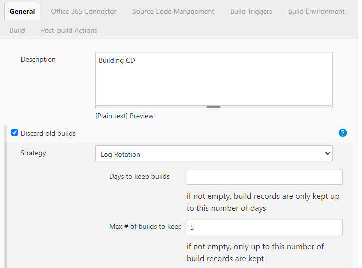

2.


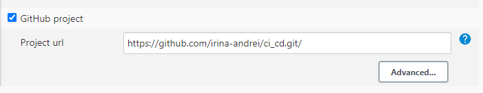

3.

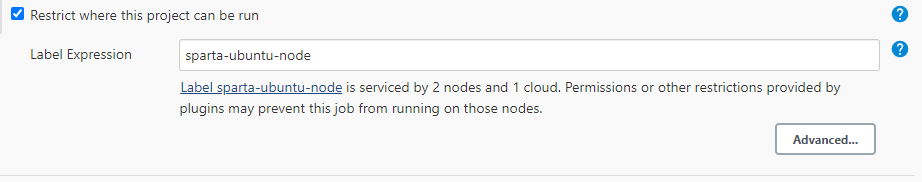

4.

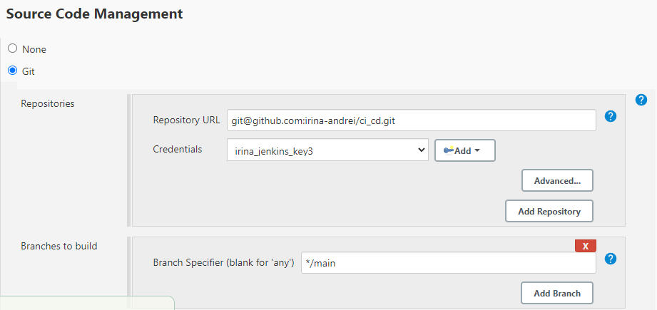

5.

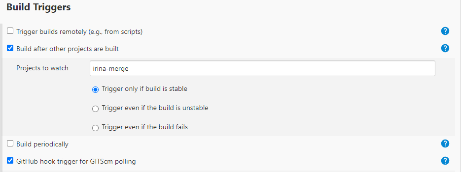

6.

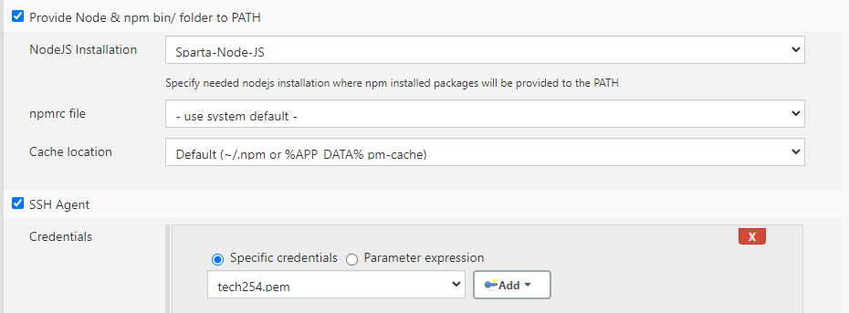

7.

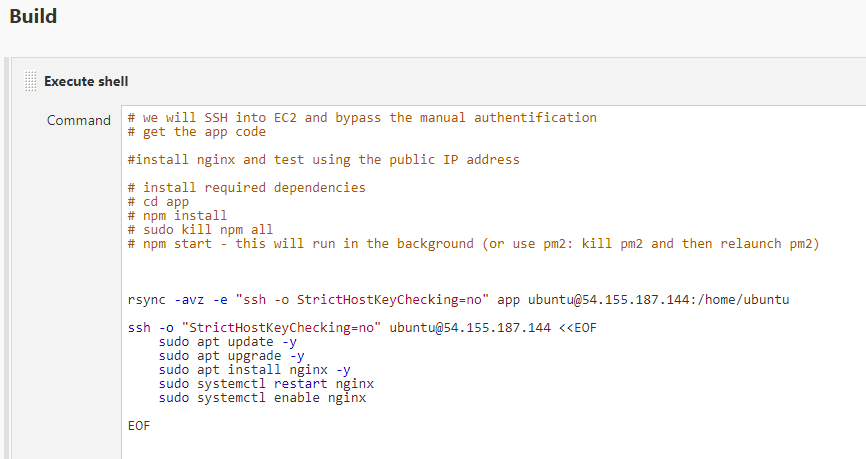

```shell
# we will SSH into EC2 and bypass the manual authentification
# get the app code

#install nginx and test using the public IP address

# install required dependencies
# cd app
# npm install
# sudo kill npm all
# npm start - this will run in the background (or use pm2: kill pm2 and then relaunch pm2)


rsync -avz -e "ssh -o StrictHostKeyChecking=no" app ubuntu@PUBLIC_IP_ADDRESS:/home/ubuntu

ssh -o "StrictHostKeyChecking=no" ubuntu@PUBLIC_IP_ADDRESS <<EOF
	sudo apt update -y
    sudo apt upgrade -y
    sudo apt install nginx -y
    sudo systemctl restart nginx
    sudo systemctl enable nginx
    
EOF
```

<br>


## The CD App Task Steps (4rd Job - 'CD-app'):

1.

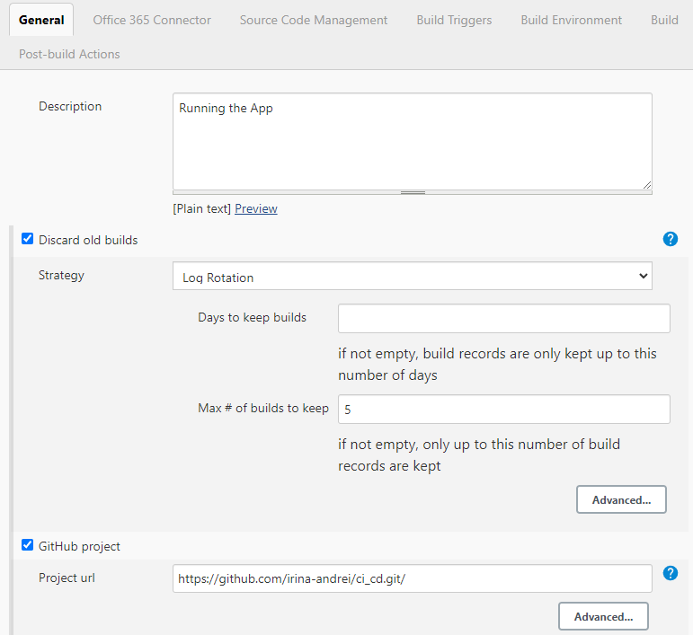

2.

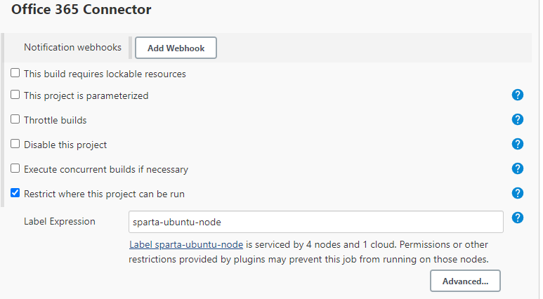

3.

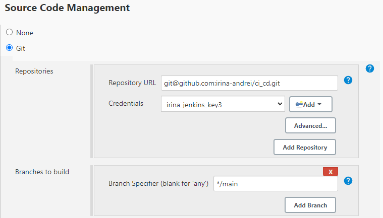

4.

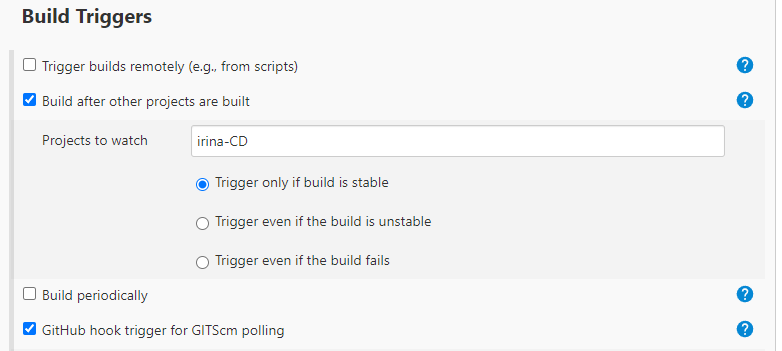

5.

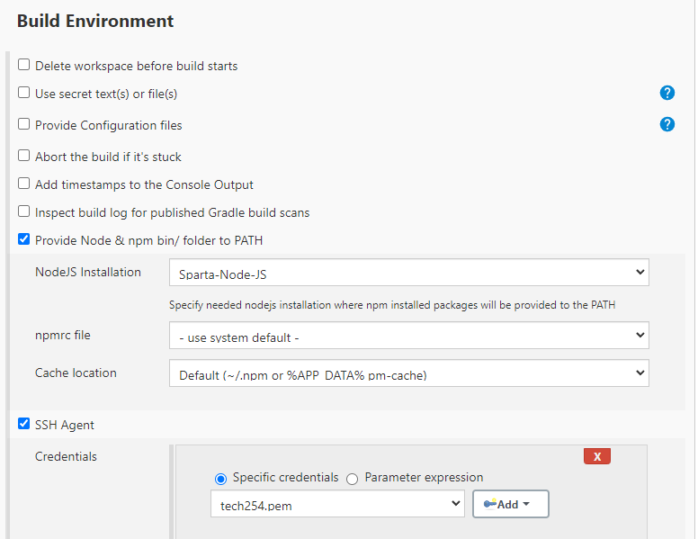

6.

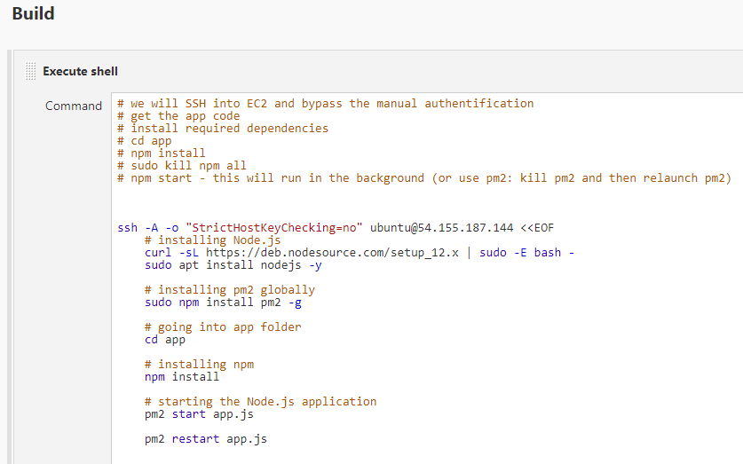


```shell
# we will SSH into EC2 and bypass the manual authentification
# get the app code
# install required dependencies
# cd app
# npm install
# sudo kill npm all
# npm start - this will run in the background (or use pm2: kill pm2 and then relaunch pm2)


ssh -A -o "StrictHostKeyChecking=no" ubuntu@54.155.187.144 <<EOF
	# installing Node.js
	curl -sL https://deb.nodesource.com/setup_12.x | sudo -E bash -
	sudo apt install nodejs -y
 
	# installing pm2 globally
	sudo npm install pm2 -g
 	
    # going into app folder
	cd app
 
	# installing npm
	npm install
 
	# starting the Node.js application
    pm2 start app.js
 
	pm2 restart app.js

```

<br>

Sources:

- [CI/CD Best practices - JetBrains.com](https://www.jetbrains.com/teamcity/ci-cd-guide/ci-cd-best-practices/)
- [CI/CD Process - CodeFresh.io](https://codefresh.io/learn/ci-cd-pipelines/ci-cd-process-flow-stages-and-critical-best-practices/)
- [What Is SDLC? - stacify.com](https://stackify.com/what-is-sdlc/)
- [What Is the Software Development Life Cycle? - Coursera.org](https://www.coursera.org/articles/software-development-life-cycle)