# Creating a CI/CD Pipeline with Jenkins

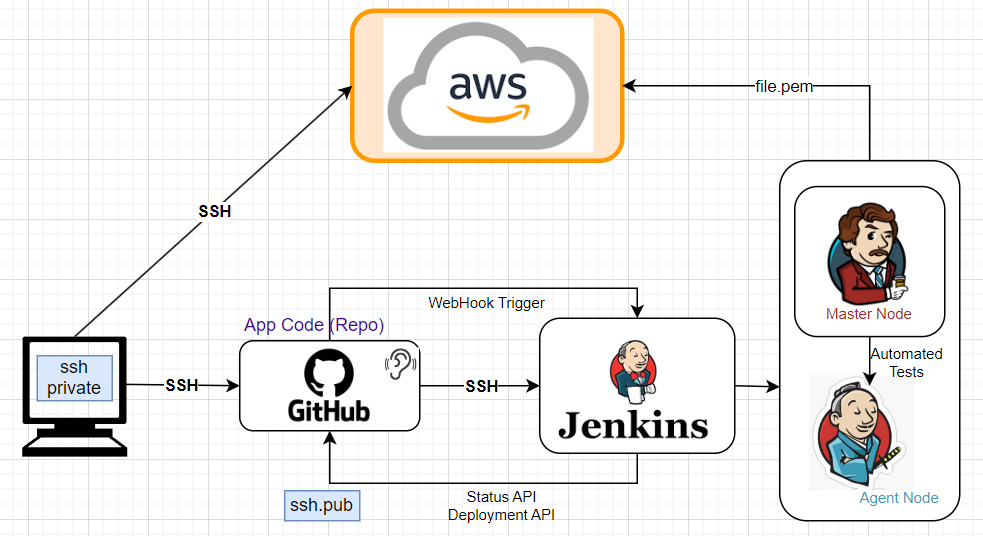

We will build our own Jenkins Server with the required environments, and rebuild the Jenkins pipeline up to the deployment of the app (our 4 jobs).


## Steps:

```DIAGRAM PLACEHOLDER```


1. Launch your instance and choose an appropriate name (recommended AMI: `ami-0136ddddd07f0584f`):

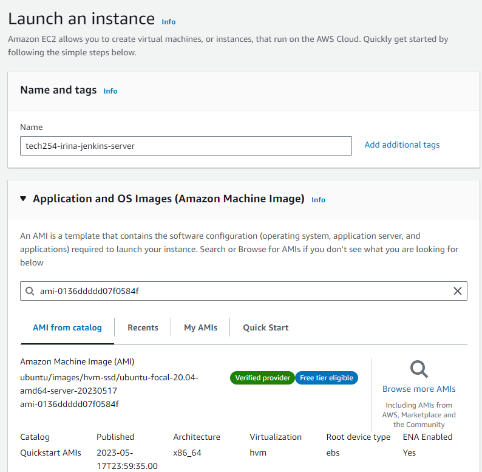

2. Select the `t2.micro` and the correct Key pair:

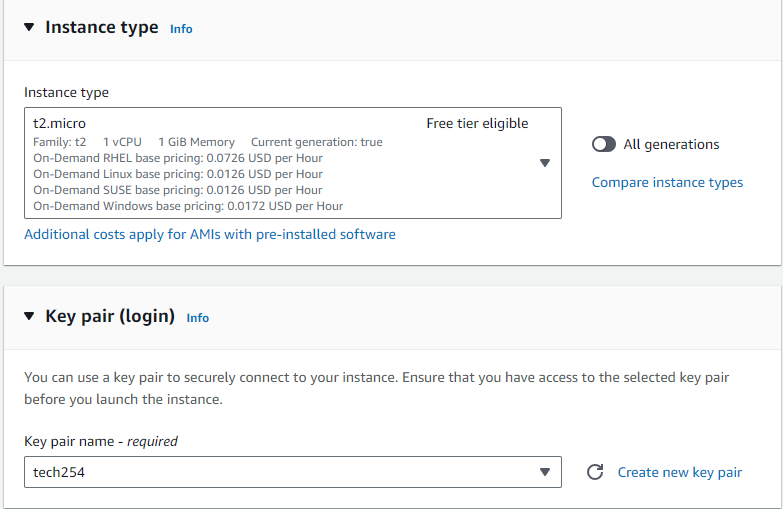

3. Select your custom VPC. You will also need to configure your instance security group to allow inbound traffic on port 8080 for Jenkins from your IP address:

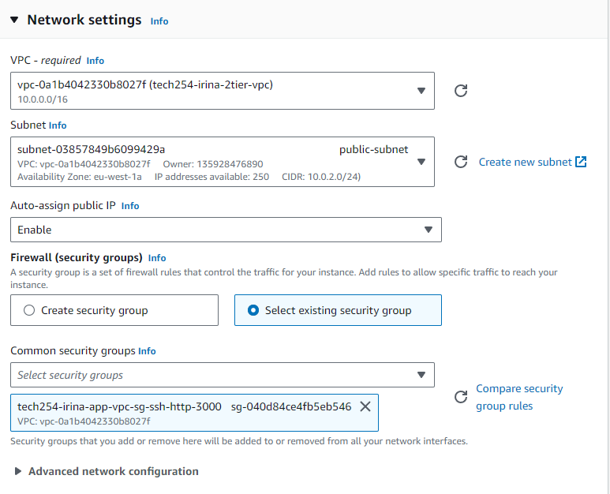

4. Once your Instance is up and running, connect through SSH from Git Bash.

5. Once you are connected, run the appropiate code to install all dependencies:

```shell
# Update the package manager
sudo apt update
sudo apt upgrade -y

# Install Java
sudo apt install openjdk-11-jdk -y

# Add the Jenkins repository
wget -q -O - https://pkg.jenkins.io/debian-stable/jenkins.io.key | sudo apt-key add -

sudo apt-key adv --keyserver keyserver.ubuntu.com --recv-keys 5BA31D57EF5975CA

sudo sh -c 'echo deb https://pkg.jenkins.io/debian-stable binary/ > /etc/apt/sources.list.d/jenkins.list'

# Update the package manager again
sudo apt update

# Install Jenkins
sudo apt install jenkins -y

# Start the Jenkins service
sudo systemctl start jenkins

# Enable the Jenkins service
sudo systemctl enable jenkins

```


7. After installing Jenkins, you can access it by typing in the IP address of your instance followed by port 8080 in your browser. For example, http://<instance_ip>:8080. This is what the first page will look like:

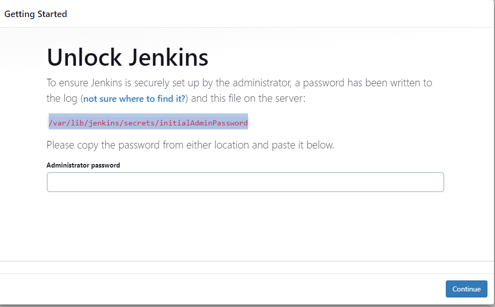

8. You can get the password using:

```shell
sudo cat /var/lib/jenkins/secrets/initialAdminPassword
```


8. Choose to 'Select plugins to install':

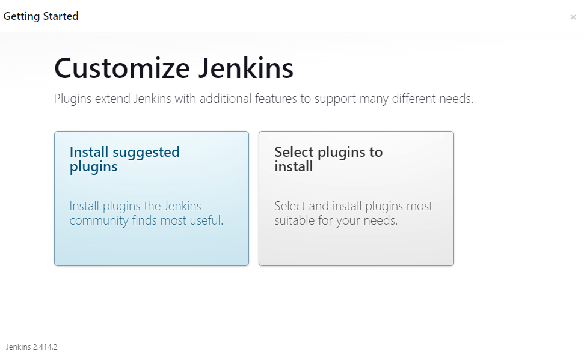

9. The plugins will install one by one:

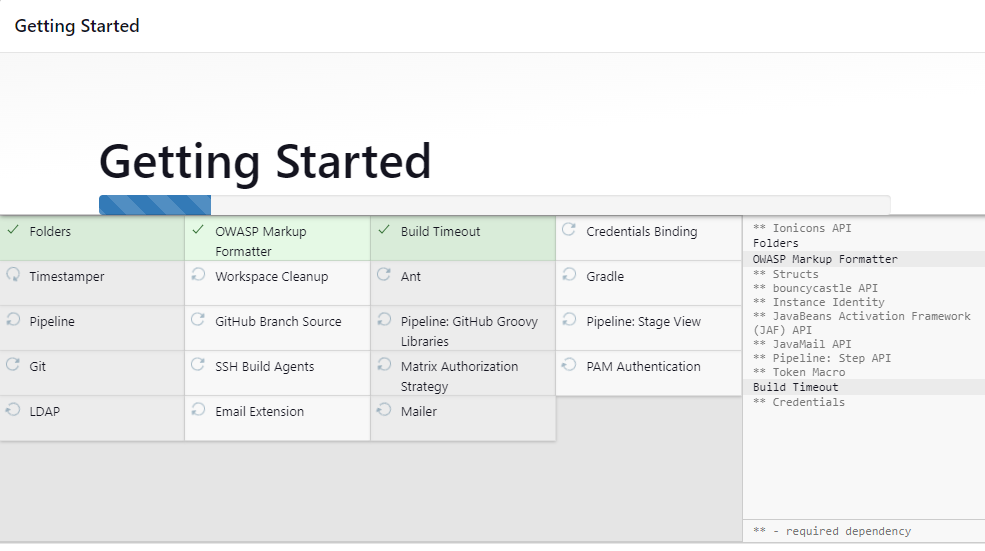

10. Next, you will then need to enter the initial admin password that can be found in `/var/lib/jenkins/secrets/initialAdminPassword` on your instance. If you just want to run it as `admin` without a password, you can skip this step. 


11. The Instance Configuration URL:

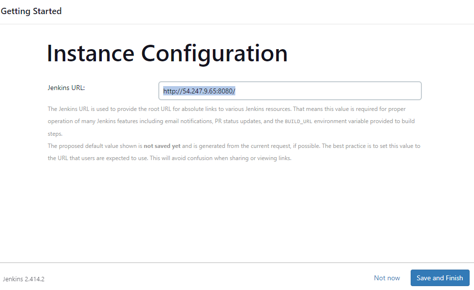

12. You will receive confirmation Jenkins was set up and is ready to use:

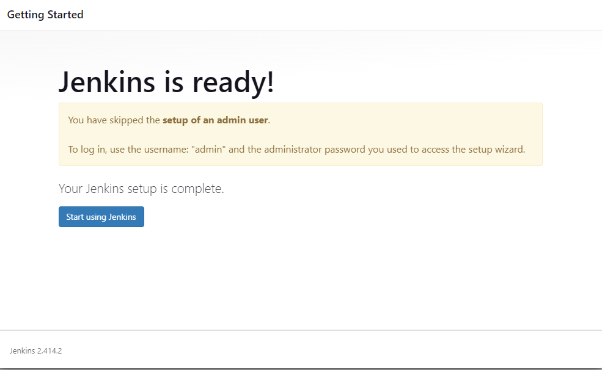

13. The hole page of Jenkins:

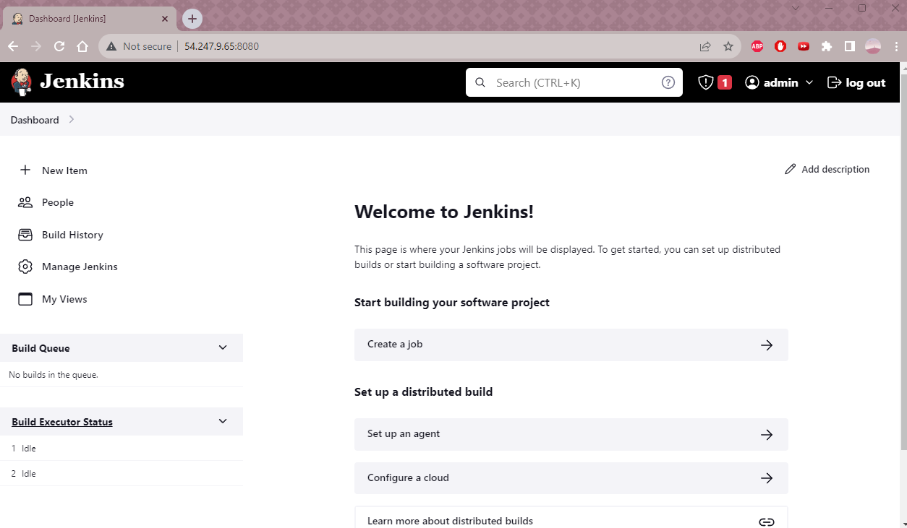

14. will also need to add github.com as a Known Host to allow SSH keys on GitHub:


```shell
# from 'ubuntu@ip-10-0-2-137' you can change user to jenkins
sudo su - jenkins
# after change, it will show as 'jenkins@ip-10-0-2-137'

# Add github.com as a Known Host to allow SSH keys on GitHub:
ssh-keyscan github.com >> ~/.ssh/known_hosts
```

15. nodejs


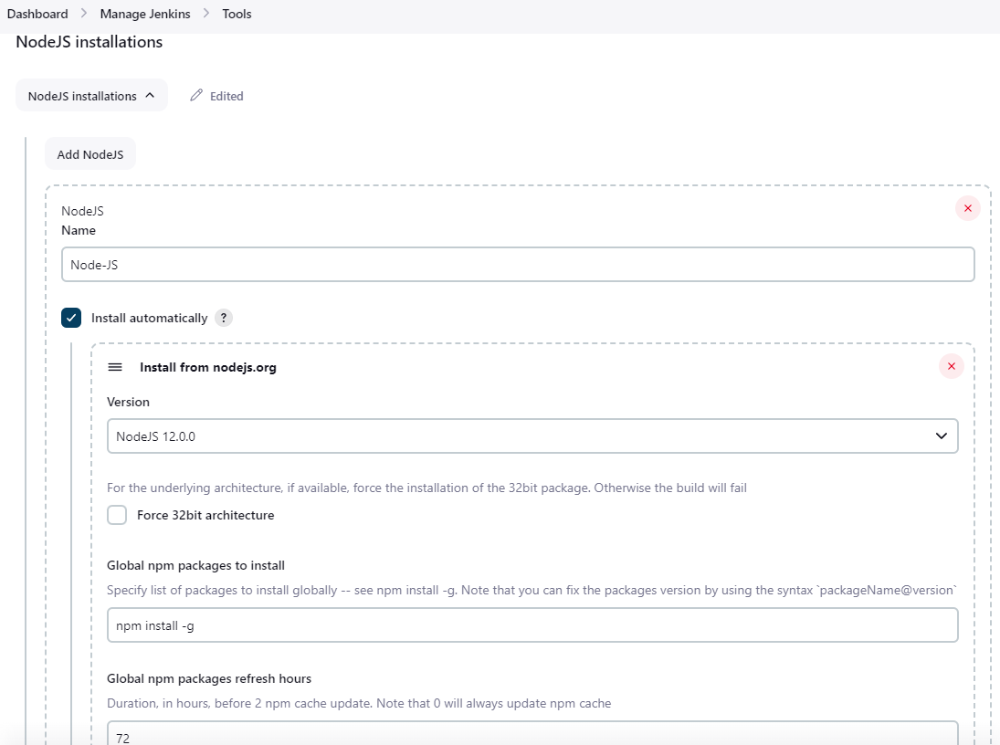

14. Once you build your first job, it will appear in the Dashboard:

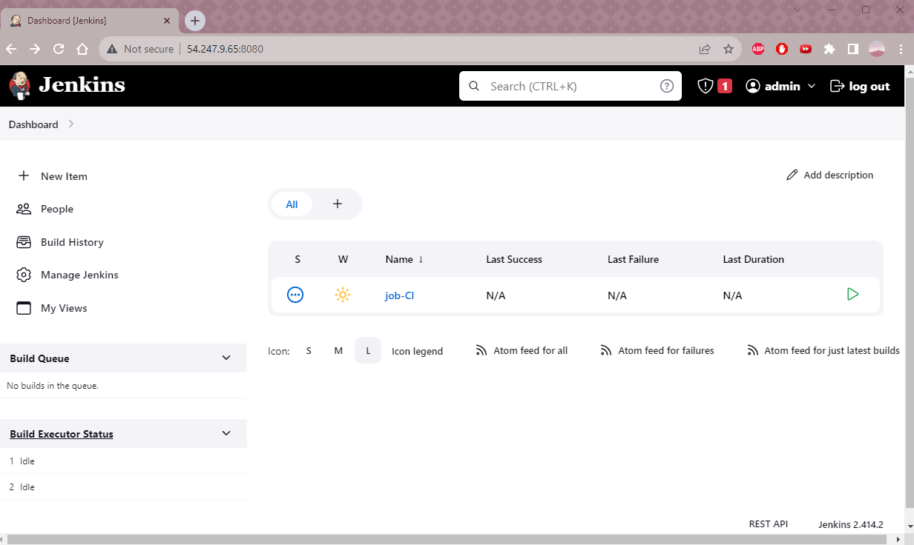


<br>

Sources:

https://www.knowledgehut.com/blog/devops/install-jenkins-ubuntu#why-use-jenkins?%C2%A0

https://www.letscloud.io/community/how-to-install-jenkins-on-ubuntu-2004

https://dev.to/aws-builders/jenkins-installation-configuration-on-aws-ec2-linux-instance-3npl

https://d1.awsstatic.com/Projects/P5505030/aws-project_Jenkins-build-server.pdf

https://www.jenkins.io/doc/tutorials/tutorial-for-installing-jenkins-on-AWS/
