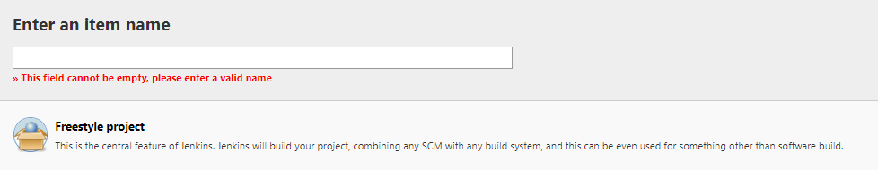
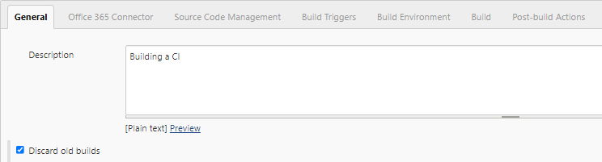
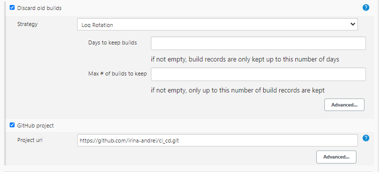
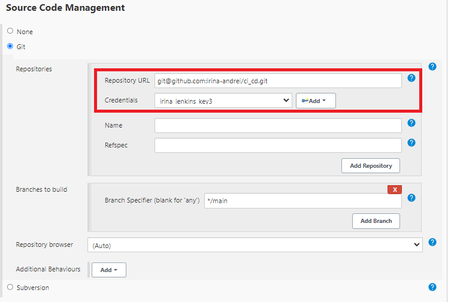
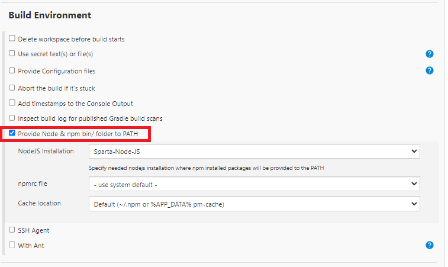
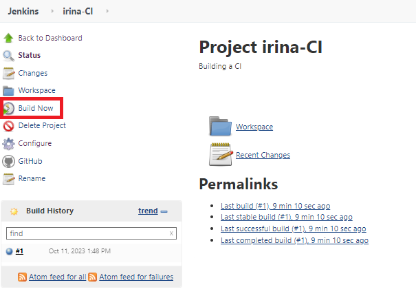

# Jenkins

### What is Jenkins?

Jenkins is an **open-source automation server** in which the central build and CI process take place. It is a Java-based program with packages for Windows, macOS & Linux.

<br>

### Stages of Jenkins:
**1** — Creating a Jenkins job 

**2** — Building a pipeline in Jenkins

**3** — Linking the jobs

<br>

### What alternatives are there for Jenkins?
* CircleCi
* TeamCity
* Bamboo
* GitLab

<br>

### Why Jenkins?

* Jenkins has great range of plugins available.
* it supports building, deploying and automating for software development projects.
* easy installation.
* simple and user-friendly interface.
* extensible with huge community-contributed plugin resource.
* easy environment configuration in user interface.
* supports distributed builds with master-slave architecture.


<br>

### Jenkins Job page:


You can see everything to do with your Job.

<br>

## Steps:

1. Start a new Job: 


2. Choose a name and then click Freestyle project:



3. Write a Description and Select Discard old builds:



4. Enter the IP Address for the repo:


5. Enter the SSH url for the repo and the key to access:


6. Tick "Provide Noge & npm bin/folder to PATH" box:



7. And 'Execute shell' and enter:

```shell
cd app
npm install
npm test
```

8. After you saved it, press Build Now:

