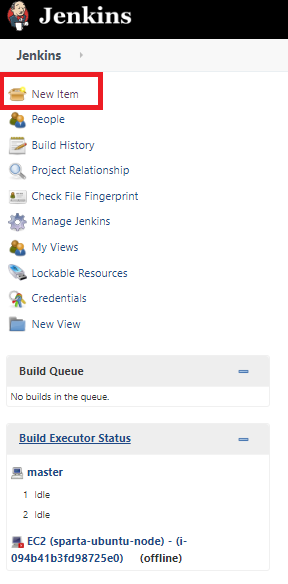

# Jenkins

### What is Jenkins?

Jenkins is an **open-source automation server** in which the central build and CI process take place. It is a Java-based program with packages for Windows, macOS & Linux.

 

### Stages of Jenkins:
**1** — Creating a Jenkins job 

**2** — Building a pipeline in Jenkins

**3** — Linking the jobs

 

### What alternatives are there for Jenkins?
* CircleCi
* TeamCity
* Bamboo
* GitLab

 

### Why Jenkins?

* Jenkins has great range of plugins available.
* it supports building, deploying and automating for software development projects.
* easy installation.
* simple and user-friendly interface.
* extensible with huge community-contributed plugin resource.
* easy environment configuration in user interface.
* supports distributed builds with master-slave architecture.

 

### Jenkins Navigation Panel:

Here you can crate a new job and see your Build History. 

### Jenkins Job page:

You can see everything to do with your Job, including all the build history.