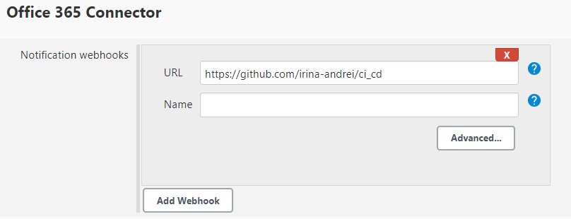
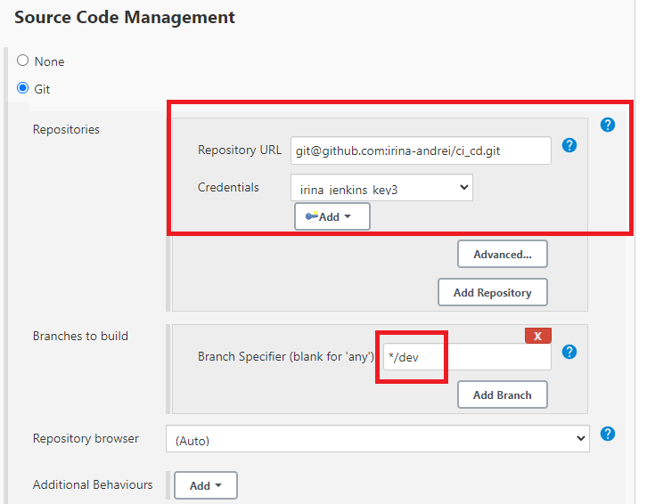
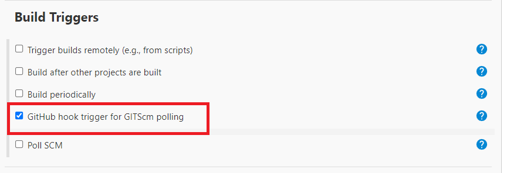
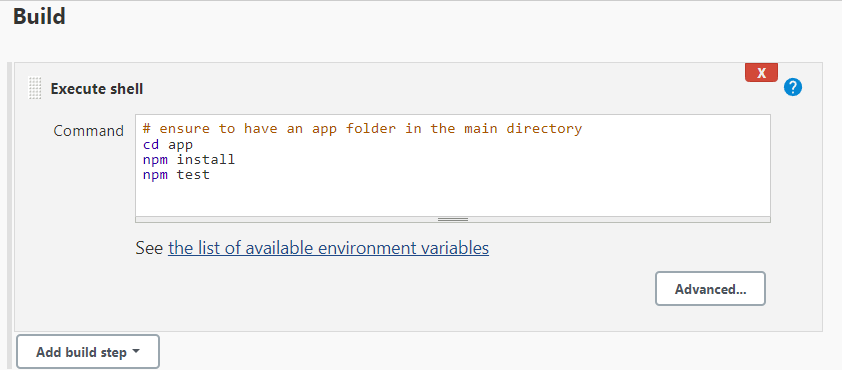
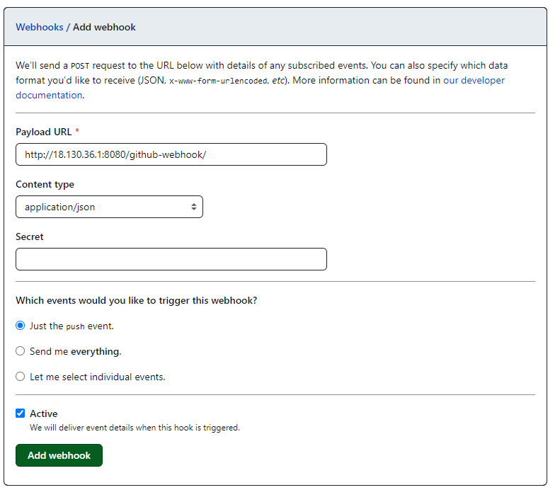
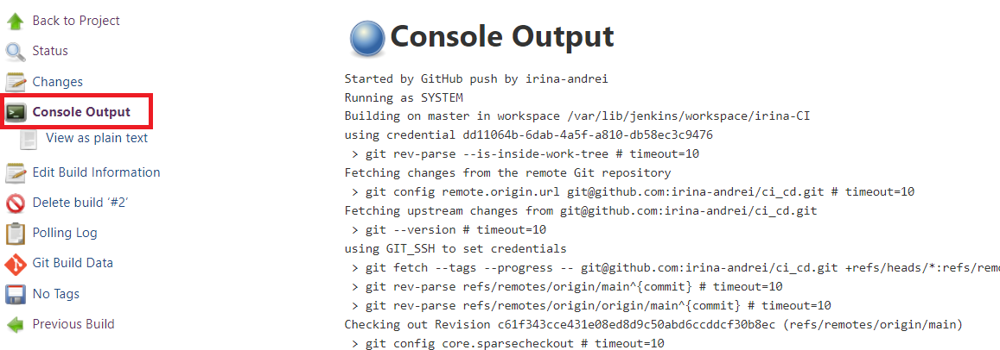

# Jenkins


### What is Jenkins?

Jenkins is an **open-source automation server** in which the central build and CI process take place. It is a Java-based program with packages for Windows, macOS & Linux.

<br>

### Stages of Jenkins:
**1** — Creating a Jenkins job 

**2** — Building a pipeline in Jenkins

**3** — Linking the jobs

<br>

### What alternatives are there for Jenkins?
* CircleCi
* TeamCity
* Bamboo
* GitLab

<br>

### Why Jenkins?

* Jenkins has great range of plugins available.
* it supports building, deploying and automating for software development projects.
* easy installation.
* simple and user-friendly interface.
* extensible with huge community-contributed plugin resource.
* easy environment configuration in user interface.
* supports distributed builds with master-slave architecture.


<br>

### Jenkins Job page:


You can see everything to do with your Job.

<br>


## Steps for creating a Job and setting up WebHook:

1. Initialise a new Job: 


2. Choose a name and then click Freestyle project:


3. Write a Description and Select Discard old builds:


4. Enter the IP Address for the repo:


5. In Webhook, add your Repository link:



6. Enter the SSH url for the repo and the key to access:



7. In Build Trigger, tick the 'GitHub hook trigger for GITScm polling' box:



8. Tick "Provide Node & npm bin/folder to PATH" box:


9. Add 'Execute shell' Commands, then press Save:

```shell
cd app
npm install
npm test
```



10. After you saved it, press Build Now to run:


11. On GitHub, add Webhook in the settings of your repository:



12. In Build History, you'll be able to see the Console Output:



<br>

Sources:

[GitHub - Jenkins - blazemeter.com](https://www.blazemeter.com/blog/how-to-integrate-your-github-repository-to-your-jenkins-project)

[DevOps Culture and CI/CD](https://medium.com/@ahshahkhan/devops-culture-and-cicd-3761cfc62450)