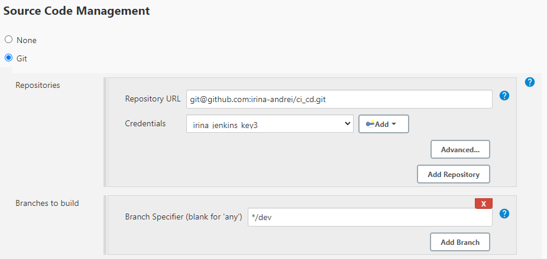
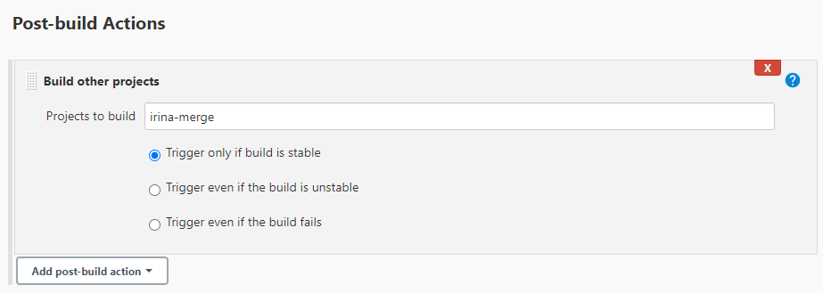
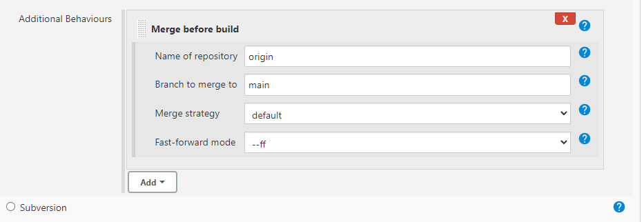
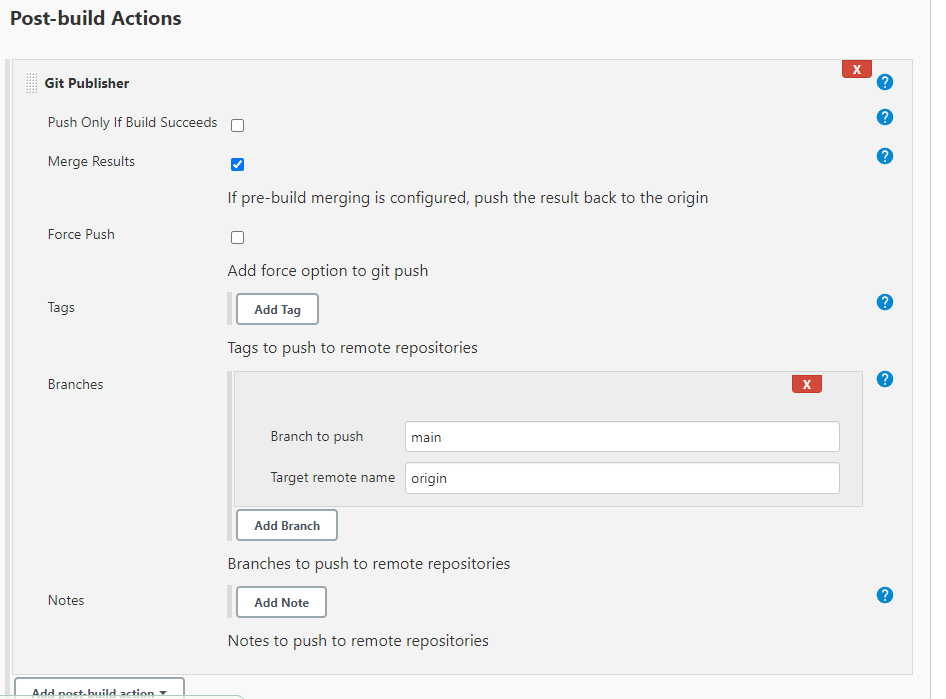

# Jenkins CI Task

Our current CI setup on Jenkins has one major flaw. The build is currently started and the tests are run on the main branch of the repository. This means that if the tests fail the code still exists on the main branch (which is only supposed to contain working code).

We need to reconfigure the job so that the code is tested on a different branch (dev) and automatically merged with the main branch if the tests pass.

 

‌### Tasks:
1. Configure your job to checkout code from the dev branch rather than the main branch.

2. Have the job merge the dev branch code with the main branch and test against that.

3. Use the Git publisher plugin to push the master branch to Github if the tests pass.

